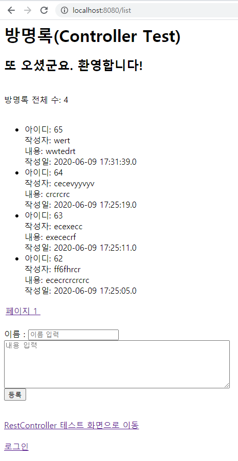
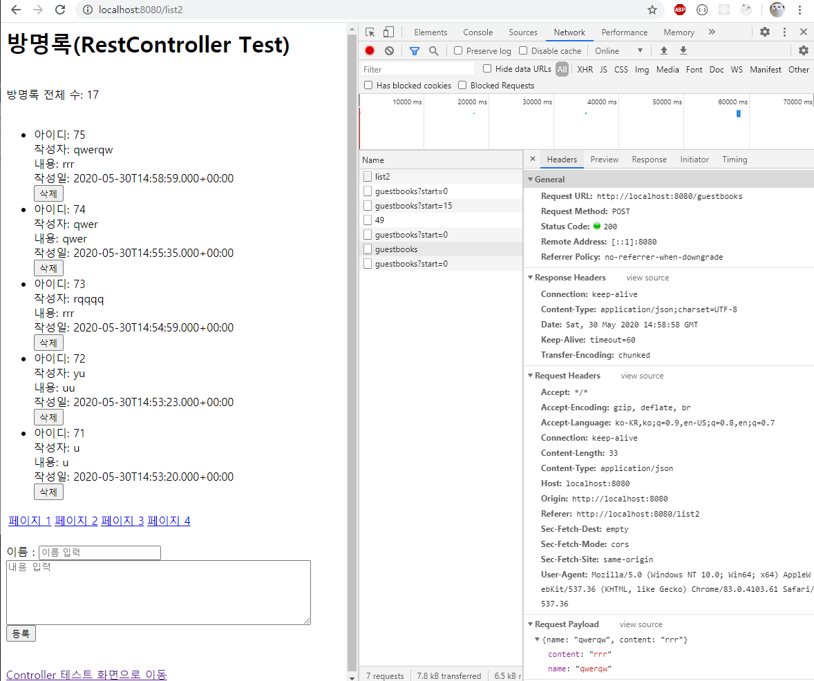
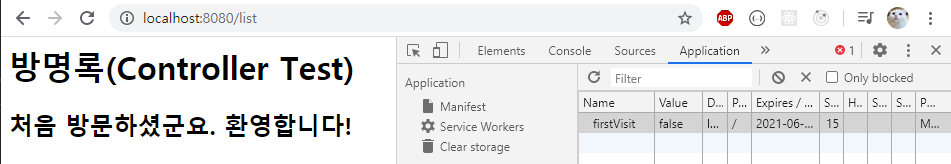
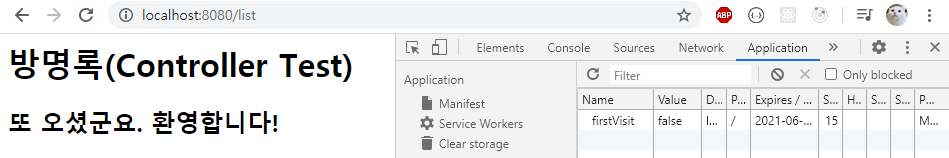

# 방명록

## 설명
Spring Boot, Spring MVC로 Layered Architecture를 구현한 방명록 프로젝트입니다. 
view는 Server side rendering을 이용하는 thymeleaf를 이용했습니다. 
이 프로젝트는 부스트 코스의 
[레이어드 아키텍처 실습1](https://www.edwith.org/boostcourse-web/lecture/16767/), 
[레이어드 아키텍처 실습2](https://www.edwith.org/boostcourse-web/lecture/16772/), 
[RestController란](https://www.edwith.org/boostcourse-web/lecture/16773/), 
[RestController를 이용하여 web api 작성하기](https://www.edwith.org/boostcourse-web/lecture/16774/),
[쿠키를 이용한 상태정보 유지하기](https://www.edwith.org/boostcourse-web/lecture/16800/)
를 참고하고 있습니다.

## 스크린샷

### Controller를 이용한 방명록
</img>

### RestController를 이용한 방명록
</img>

### 쿠키를 이용한 재방문 여부 확인
#### 첫 방문 시
</img> 
쿠키의 value가 false인 이유는 첫 방문시 true였던 값을 먼저 model에 attribute로 추가한 뒤, 
쿠키의 value를 false로 바꿔서 재전송하기 때문이다.

#### 재방문시 
</img>
